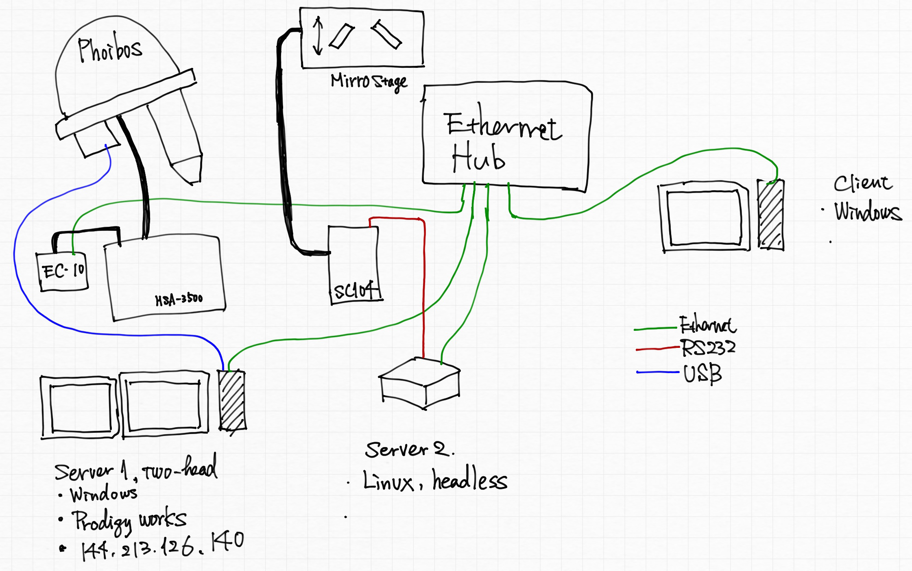

# Prodigy Remote_in

-- how to integrate the stepping motor system and the ARPES measurement.



## 0. Step zero: To control with jupyter from the client machine.

### Setting the server

Execut below on the server 2 (Linux).

```
# jupyter notebook password
```

The hash is automatically saved in `.jupyter/jupyter_notebook_config.json`

### Execute Jupyter Notebook

Execute below on the server.

```
# jupyter notebook --ip="*" --no-browser
```

###

- On the client machine, access `http://[IP address of the server]:8888`.
- jupyter notebook appear in the web browser.

## 1. Prodigy size preparation.

Note: Calibration file cannot be changed with remote-in.

## 2. Run jupyter notebook from the client PC.
