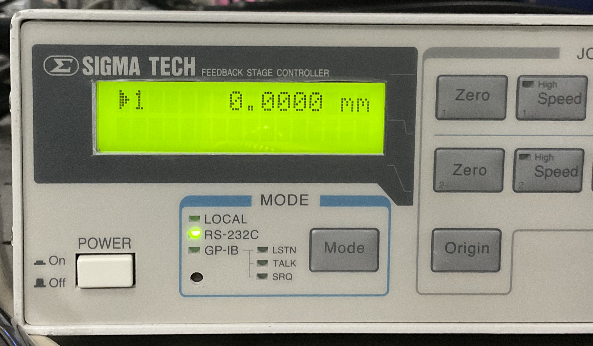
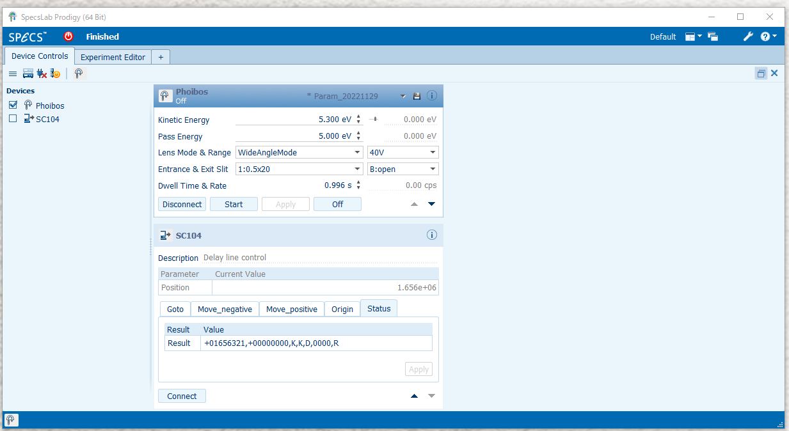

# Prodigy Remote_in

-- how to integrate the stepping motor system and the ARPES measurement.

There are three ways to achieve it.

1. Both of Prodigy and Stepping motor are controlled with the single Windows machine.

   - All works are done (of coursely) with the Windows machine.

2. Prodigy works on the Windows machine (Server 1), and the stepping motor is controled with another Windows machine (Server 2).

   - Server 2 acas as the client, the every command is sent from this machine.
   - Thus, the jupyter should run on this machine.

3. Prodigy works on the Windows machine, and the stepping motor is controled with a Linux machine.

   - As the Linux machine is headless, another Windows machine is required for the client machine.

Here, the way-1 is described.

<!-- 

Fig: The diagram of the way-3.
-->

## 1. Setting SC104 to connect with RS-232C

Confirm the "Mode" is RS232C. If not, press "Mode" button.



## 2. Make Prodigy act as the server

Confirm that "SC104" is _NOT_ connected with prodigy by checking "Device Control"



Select "Remote Control" from the menu.


and then select the template, and check "Allow Remote Connections"

- Confirm "Remote connections enabled. Listening on port 7010" in Log field.


## 3. Remote control through Jupyter

- Open the "Windows terminal"
- type the following
  > jupyter lab

Web browser is automatically opened. And then select `Prodigy_Remote_in.ipynb`


```python
## Setting for Prodigy connection
import spd_controller.Specs.Prodigy as Prodigy
from spd_controller.Specs.convert import itx
prodigy = Prodigy.RemoteIn(host="127.0.0.1")
prodigy.connect()
```

- the first two lines for load module about Prodigy (for connection & file export of the spectrum data)
- the third line make a object for connecting Prodigy
- the 4th line is for actual connection to Prodigy.

```python
## Setting for Stepping motor controller
import spd_controller.sigma.sc104 as sc104
sc104 = sc104.SC104(port="COM3")
```

<!--
The below is for way-3.

## 0. Step zero: To control with jupyter from the client machine.

### Setting the server

Execut below on the server 2 (Linux).

```
# jupyter notebook password
```

The hash is automatically saved in `.jupyter/jupyter_notebook_config.json`

### Execute Jupyter Notebook

Execute below on the server.

```
# jupyter notebook --ip="*" --no-browser
```

###

- On the client machine, access `http://[IP address of the server]:8888`.
- jupyter notebook appear in the web browser.

## 1. Prodigy size preparation.

Note: Calibration file cannot be changed with remote-in.

## 2. Run jupyter notebook from the client PC.

-->
