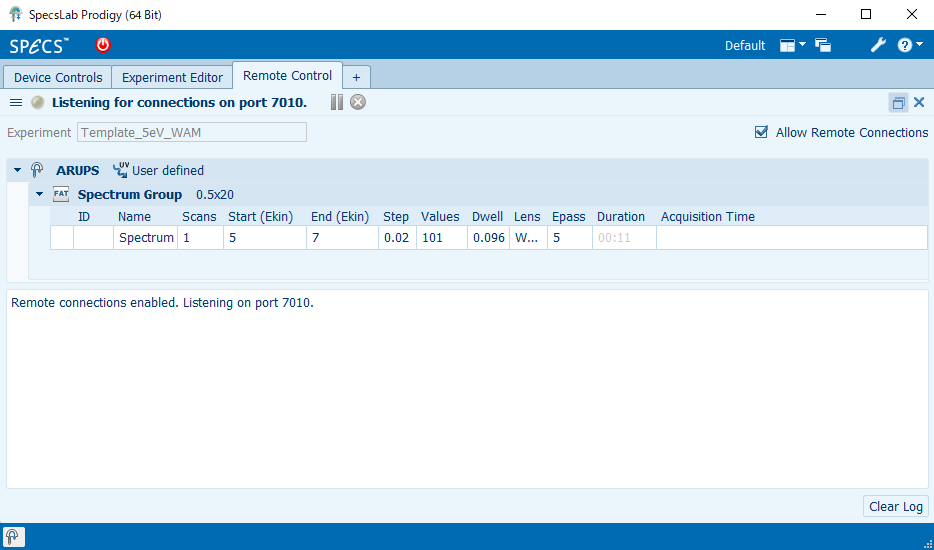

# Prodigy Remote_in

-- How to integrate the stepping motor system and the ARPES measurement.

There are three ways to achieve it.

1. Both of Prodigy and Stepping motor are controlled with the single Windows machine.

   - All works are done (of coursely) with the Windows machine.

2. Prodigy works on the Windows machine (Server 1), and the stepping motor is controled with another Windows machine (Server 2).

   - Server 2 acas as the client, the every command is sent from this machine.
   - Thus, the jupyter should run on this machine.

3. Prodigy works on the Windows machine, and the stepping motor is controled with a Linux machine.

   - As the Linux machine is headless, another Windows machine is required for the client machine.

Here, the way-1 is described.

<!-- 

Fig: The diagram of the way-3.
-->

## Setting SC104 to connect with RS-232C

Confirm the "Mode" is RS232C. If not, press "Mode" button.


## Make Prodigy act as the server

Confirm that "SC104" is _NOT_ connected with Prodigy by checking "Device Control"


Select "Remote Control" from the menu.


and then select the template, and check "Allow Remote Connections"

- Confirm "Remote connections enabled. Listening on port 7010" in Log field.



## Remote control through Jupyter

- Open the "Windows terminal"
- Go to the directory for data storing, and then copy "Prodigy_Remote_in.ipynb" to this folder.
- type the following
  > jupyter lab

A Web browser is automatically opened. And then select `Prodigy_Remote_in.ipynb`


### Configuration

The following two sets are configuration. You need to run in every measurement.

```python
## Setting for Prodigy connection
from time import sleep
import spd_controller.Specs.Prodigy as Prodigy
from spd_controller.Specs.convert import itx
prodigy = Prodigy.RemoteIn(host="127.0.0.1")
prodigy.connect()
```

Excepting the comment lines, the meaning of the each line is:

- the second, and thrid lines for load module about Prodigy (for connection & file export of the spectrum data)
- the 4th line make a object for connecting Prodigy
- the 5th line is for actual connection to Prodigy.

```python
## Setting for Stepping motor controller
## befor running the following check the connection from the SpecsLabProdigy is off.
import spd_controller.sigma.sc104 as sc104
sc104 = sc104.SC104(port="COM3")
```

- The first line to load the module to communicate the delay line stage.
- Communication to the delay line starts by the second line.

### Intensity correlation (pump-probe) measurement.

- Set the experimental parameter for the delay line stage.

(The spectrum_id is not (of coursely) the parameter for the delay line stage. This paramter is important, you must set it.)

```python
### Configureing the pump-probe experiments condition.
stage_start = 165.5000
end_stage = 165.7700
stage_move = 10 # micron unit
spectrum_id = 1
```

- Set the experimental parameter of the electron energy analyzer.

```python
prodigy.clear()  # <- clear the buffer.
prodigy.defineFAT(start_energy=5.0, end_energy=6.0, step=0.002, pass_eenrgy=5, dwell=.1)
prodigy.checkFAT(start_energy=5.0, end_energy=6.0, step=0.002, pass_energy=5, dwell=.1)  # Not absolutely required.
prodigy.set_excitation_energy(4.4417)  # <- Set the excitation photon energy
prodigy.validate()
```

In above lines, the most important is the second.
(Needless to say, the other lines excepting prodigy.checkFAAT are essential to measure.)

```python
prodigy.defineFAT(start_energy=5.0, end_energy=6.0, step=0.002, pass_eenrgy=5, dwell=.1)
```

The `dwell` and `pass_energy` can be omitted to set.
In this case, `dwell=0.1` and `pass_eergy=5` are used.

When you measure the spectra with the snapshot (SFAT) mode instaed of the FAT mode, use the following line instead of "FAT" method.

```python
prodigy.defineSFAT(start_energy=5.3, end_energy=6.1, dwell=1.0)
prodigy.checkSFAT(start_energy=5.3, end_energy=6.1, dwell=1.0) # Not absolutely required.
```

Note that, in SFAT mode, pass_energy cannot be set. And setting the step energy does not make sense.
(Pass energy is automatically set from the start and end energy). Furthermore, the number of scan (Number of accumulation) cannot be set here.

After configuration of the electron energy analyzer, the photoemission measurements can start.

The follwoing lines are an example to perform the pump-probe experiments.
**Don't just copy and paste. Use it after completely understanding.**

```python
sc104.move_abs(pos=stage_start)
current_position = sc104.position()
while current_position < end_stage:
    prodigy.scan(num_scan=3, setsafeafter=False)
    prodigy.save_data('PES_39_{0:03}.itx'.format(spectrum_id),
                      spectrum_id=spectrum_id,
                      comment="position:{:.4f};".format(current_position), measure_mode="FAT")
    sc104.move_rel(move=stage_move, micron=True)
    current_position = sc104.position()
    spectrum_id +=1  # Increment the spectrum_id
sleep(1)
prodigy.set_safe_state()
```

Note (about `set_safe_state()` command and `setsafeafter` argument):
Specifies whether the analyzer should be set into the safe state after the scan or not (Boolean value, as string).
If set to False the detector voltage is not ramped down after the scan and prone to damage by other sources (like ion sources). (default: True)

<!--
The below is for way-3.

## 0. Step zero: To control with jupyter from the client machine.

### Setting the server

Execut below on the server 2 (Linux).

```
# jupyter notebook password
```

The hash is automatically saved in `.jupyter/jupyter_notebook_config.json`

### Execute Jupyter Notebook

Execute below on the server.

```
# jupyter notebook --ip="*" --no-browser
```

###

- On the client machine, access `http://[IP address of the server]:8888`.
- jupyter notebook appear in the web browser.

## 1. Prodigy size preparation.

Note: Calibration file cannot be changed with remote-in.

## 2. Run jupyter notebook from the client PC.

-->
