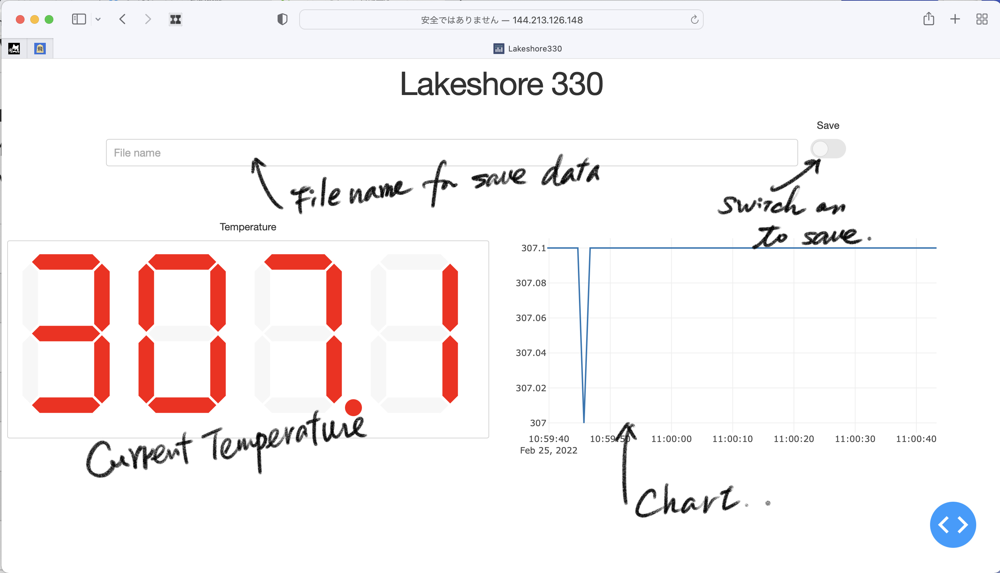

# dash_Lakeshore.py

Web application to display and record the sample temperature measured with Lakeshore 330

## How to use

- Server
  1. ssh 144.213.126.148
  2. `sudo gpib_config`
  3. `python3 dash_Lakeshore.py`
- Client side
  1. Access 144.213.126.148:8050 with the web browser

Scrren shot of the Web browser:

