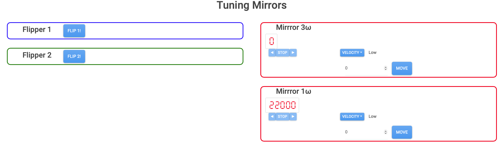

# dash_tuning_mirror.py

Web application to control (two) mirror flipper and (two) mirror angle, by using MFF101 (Thorlabs) and Picomotor9742 (Newport).

## How to use

- Server side

In many case, the web-based control system is running. If you cannot access the web page, check the following.

0. (`sudo usermod -a -G dialout,gpio,i2c, spi,netdev` spd is required, when the servern machine is replaced.)
1. `ssh spd@144.213.126.146` on the client machine to login the server. (Password is "spd")
2. check `(py311)` is seen on the prompt. If not, try `source env/py311/bin/activate.fish`
3. `python3 ~/src/spd_controller/script/dash_tune_mirror.py` to start the controll server.

   - Use `nohup python3 ~/src/spd_controller/script/dash_tune_mirror.py &` if you have known about the "nohup" command. (It would be better.)

If something wrong happens, reboot the server. by `sudo reboot` and then login the server once again.
(After the rebooting, the current positions of the mirros are lost.)

- Client side

  1. Access 144.213.126.146:8050 with the web browser

Screen shot of the Web browser:

Tooltip should appear when the mouse cursor on the buuton.

