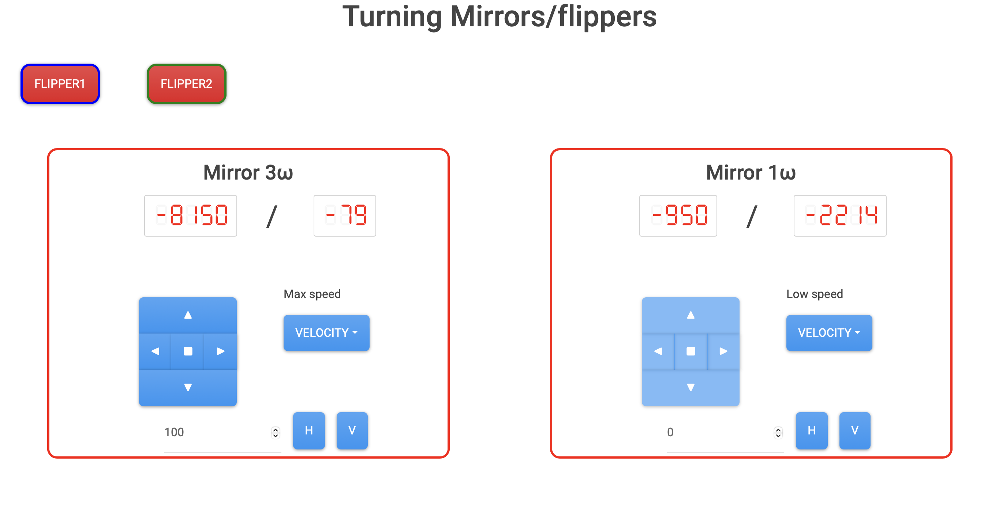

# dash_tuning_mirror.py

Web application to control (two) mirror flipper and (twot) mirror angle, by using MFF101 (Thorlabs) and Picomotor9742 (Newport).

## How to use

- Server side

In many case, the web-based control system is running. If you cannot access the web page, check the following.

0. (`sudo usermod -a -G dialout,gpio,i2c, spi,netdev` spd is required, when the servern machine is replqced.)
1. `ssh spd@144.213.126.146` on the client machine to login the server.
2. check `(py311)` is seen on the prompt. If not, try `source env/py311/bin/activate.fish`
3. `python3 ~/src/spd_controller/script/dash_tune_mirror.py` to start the controll server.

- Client side
  1. Access 144.213.126.146:8050 with the web browser

Scrren shot of the Web browser:

Tooltip should appear when the mouse cursor on the buuton.

