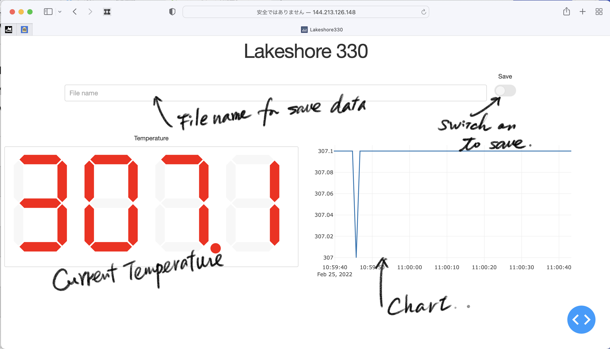

# dash_Lakeshore.py

Lakeshore 330 の温度表示、記録をするための簡易Web application.

使い方。

1. ssh 144.213.126.148 に入る。 (　`sudo gpib_config` をする必要があるかもしれない)
2. `cd ~/src/raspberry/LTmeasure` && `python3 dash_Lakeshore.py`
3. web browser で 144.213.126.148:8050 にアクセス。

Web browser での実行画面はこんな感じ。

